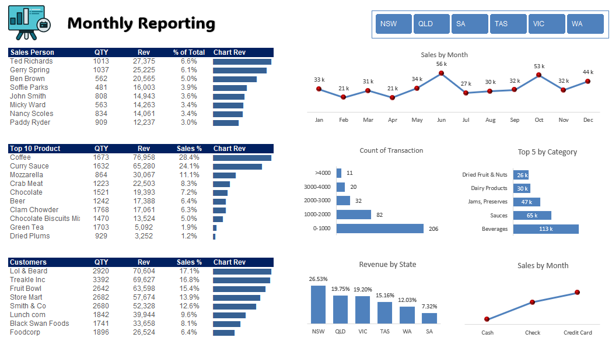

# Excel Sales Dashboard

Author: Abhishek Gupta  

## Project Overview
This project presents a sales dashboard built using Microsoft Excel.  
It uses pivot tables and charts to analyze sales performance and trends.

## Tools Used
- Microsoft Excel  
- Pivot Tables  
- Charts  

## Dashboard File
[Download Excel Dashboard](PivotDashboard_FINAL.xlsx)

## Dashboard Preview

## Insights
- Sales performance analysis  
- Trend analysis  
- KPI tracking  
